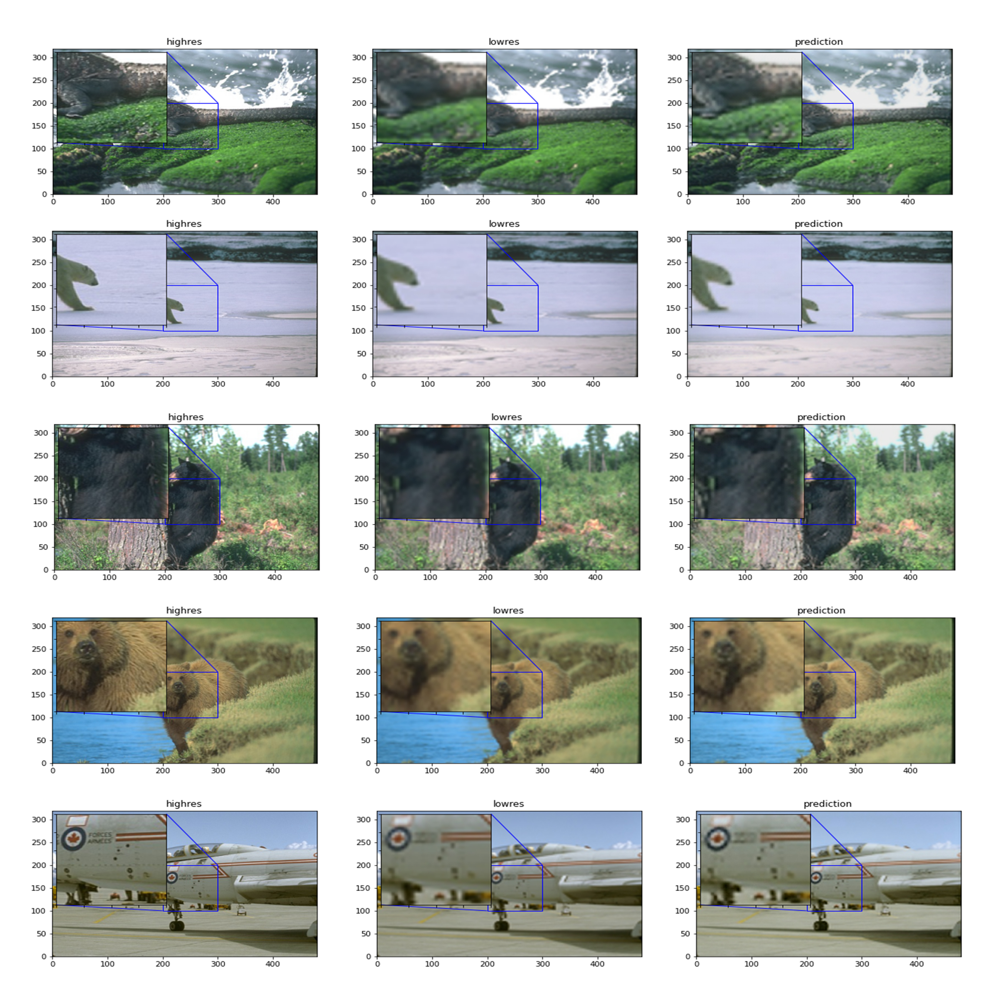

# Image Upscaling using CNNs

Convolutional neural networks are commonly used in image recognition and natural language processing and they are Deep Learning algorithms. Their architecture is inspired by the organization of neurons on the human visual cortex which makes them very good at picking up on patterns from the input images.

This repository contains a notebook with the implementation of a simple CNN with the objective of demonstrating how these neural networks can be useful for image processing.

Further explanation can be found in the medium article: https://guipleite.medium.com/an-introduction-to-convolutional-neural-networks-for-image-upscaling-using-sub-pixel-cnns-5d9ea911c557

